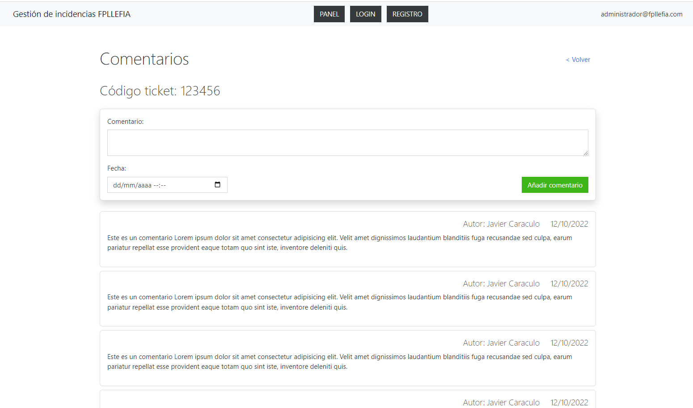

# UF2 Ejercicio 1 - Tickets

## Tarea 1: Crear el proyecto
1. Crea un proyecto con npm init 
2. Instala eslint
3. Crea un archivo index.html con las etiquetas header y main
4. Crea e importa el archivo main.js
## Componente header
5. Crea un componente con nombre header, es decir, un objeto con el atributo template y el metodo script()
6. En el atributo template del componente header crea un html correspondiente al del prototipo e inyéctalo en la etiqueta '<header></header>' de index.html desde main.js
## Vistacomentarios
7. Crea la `vistaComentarios.js` (la parte estática) con un h1 y un h2 y el form para crear comentarios (reutiliza el código html del prototipo) e inyectala en la etiqueta main.
## Base de datos
8. Crea un archivo `bd.js` con un array que contenga algunos comentarios de ejemplo y expórtalo.
## Componente comentario
9.  Crea el componente `comentario.js`. Este:
   1.  Tendra un atributo template con la estructura html del prototipo
   2.  un método script(nombre, fecha, comentario) que inyectará el nombre, fecha y comentario en su template correspondiente.
   3.  Puedes utilizar, si lo prefieres, el modelo de componente basado en función, como vimos en la sesión 6.
## Componente comentarios
10. Crea el componente `comentarios.js` el cual recibe una base de datos de comentarios y devuelve un conjunto de comentarios (usando el componente comentario.js). Después cárgalo en la vistaComentarios

